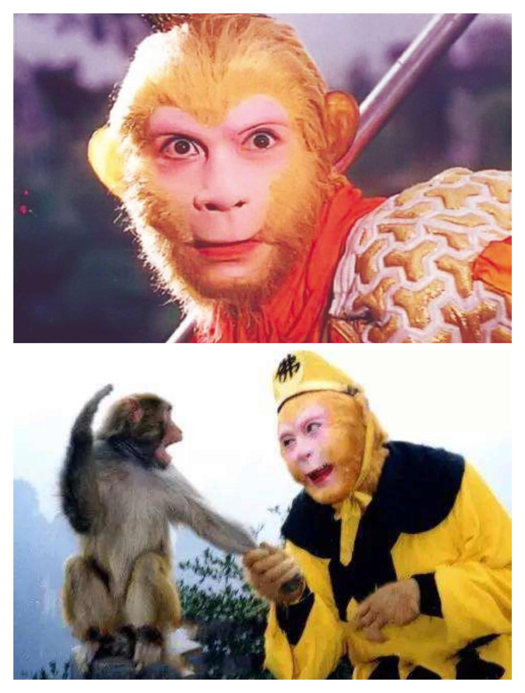
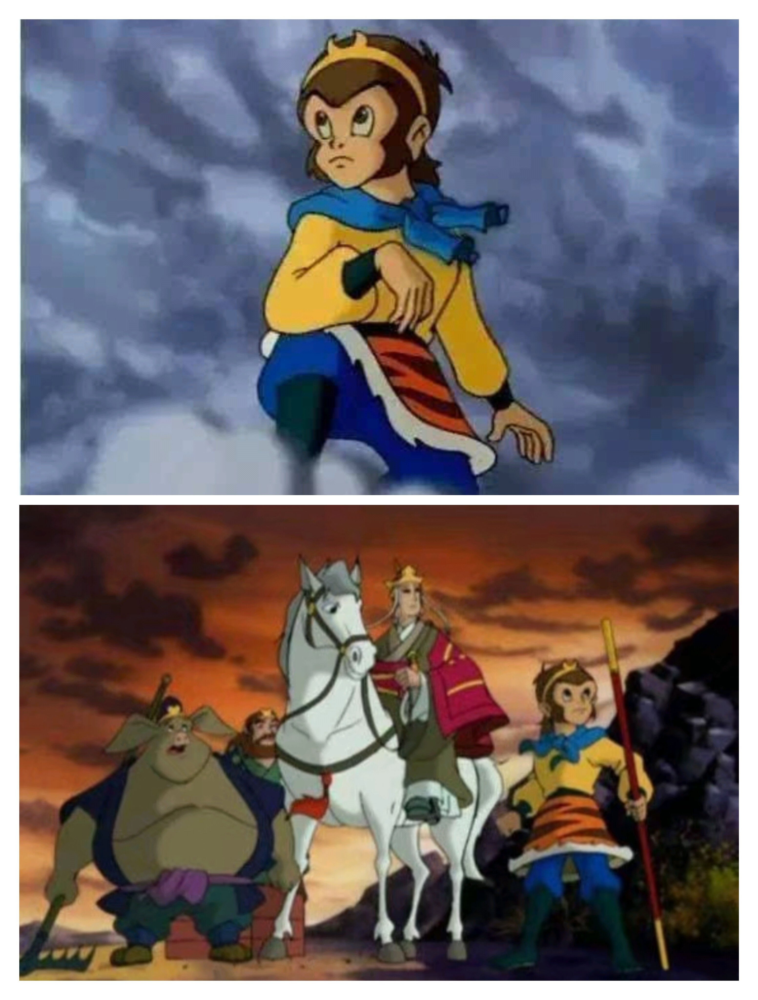
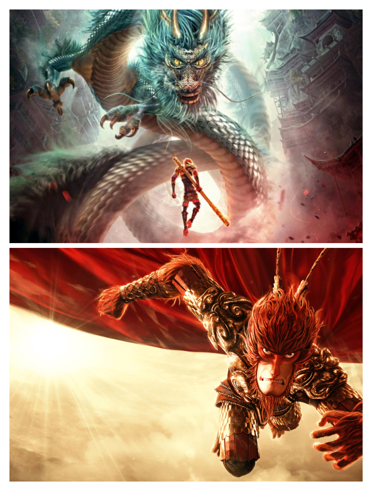
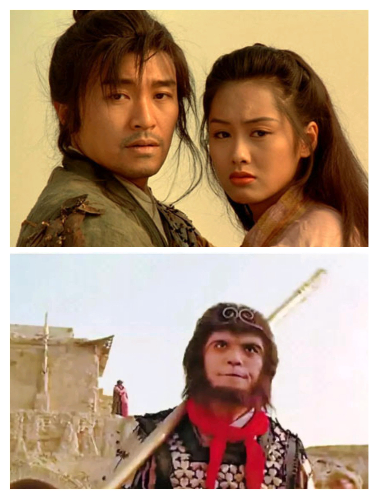

#                                                                                             人物介绍

**孙悟空**
中国古典名著《西游记》中的主角
1.**孙悟空**（The Monkey King，又称齐天大圣、孙行者、斗战胜佛），是中国四大名著小说《西游记》（作者：吴承恩）中的主要角色之一。
2.**人物经历**：孙悟空由开天辟地产生的仙石孕育而生，出生地位于东胜神洲的花果山，为了学艺而漂洋过海拜师于须菩提祖师，学会七十二变、筋斗云等法术。后在东海龙宫取得如意金箍棒， 大闹地府惊动上天而被玉皇大帝招安封为弼马温。在天庭又偷吃太上老君的金丹，炼成火眼金睛。大闹天宫，与如来佛祖的打赌斗法中失利，被压在如来用五指化作的五行山下五百余年悔过自新。后经观音点化，被唐僧救出，与猪八戒，沙悟净一同保护唐僧西天取经，一路降妖除魔，历经九九八十一难，最后取得真经修成正果，被封为斗战胜佛。

3.**人物艺术**：孙悟空的文学艺术造型反映了中国古代的诸多哲学思想，现代学者普遍认为孙悟空的形象代表了当时人民渴望反抗残暴的朝廷却又无力改变现实的情景。同时孙悟空还是一个尝试超越自然秩序的代表，其名被许多宗教学者解释为：因“悟”，则“空”。反映了现实秩序中的空洞和虚无，人类追求新秩序以及自由的思想。看人物评价

4.**相关影视**：有关孙悟空的知名作品有：西游记(1986年电视剧) ，六小龄童饰演；大话西游（1995年电影），由周星驰饰演；西游记之大圣归来（2015年动画），孙悟空的人生模拟器（小说）。

5.**我的看法**：孙悟空英勇无畏，具有强烈的反抗精神。他敢与至高至尊的玉皇大帝斗，愣是叫响了“齐天大圣”的美名；敢与妖魔鬼怪斗，火眼金睛决不放过一个妖怪，如意金箍棒下决不对妖怪留情；敢与重重困难斗争，决不退却决不低头。我们真应该学习孙悟空这种天不怕地不怕，顽强不屈的'精神，敢与一切恶势力斗，敢与一切不良现象斗，敢与一切困难斗，永远不抛弃，不放弃，敢于斗争，敢于质疑！

# 影视图片

==1.西游记电视==

==2.动画西游==

==3.大圣归来==

==4.大话西游==

